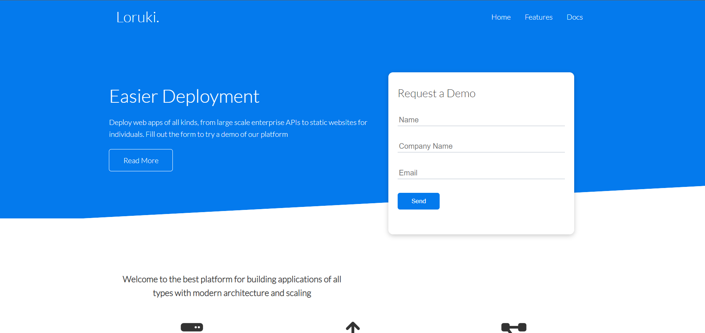

#  Loruki-Fake-Hosting-Website

Loruki is a fake hosting website which is built using HTML, CSS and Javascript. It is a fully responsive website which is built using "CSS Grid" and "Flexbox". It is a very simple website which is built for learning purpose.

## Table of contents

- [Overview](#overview)
  - [About tindog](#about-tindog)
  - [Screenshot](#screenshot)
  - [Links](#links)
- [My process](#my-process)
  - [Built with](#built-with)
  - [What I learned](#what-i-learned)
  - [Continued development](#continued-development)
  - [Useful resources](#useful-resources)
- [Author](#author)
- [Acknowledgments](#acknowledgments)


## Overview

### About Loruki

This is a simple website which is built for learning purpose. It is a fully responsive website which is built using "CSS Grid" and "Flexbox". It is a very simple website which is built for learning purpose.

### Screenshot




### Links


- Live Site URL: [Github Pages](https://saurabh13042004.github.io/Loruki-hosting-platform-website/)


## My process

### Built with

- HTML5
- CSS custom properties
- Flexbox
- CSS Grid
- Bootstrap 5
- Javascript


### What I learned

While making this project i learned a lot of things like "CSS Grid" and "Flexbox" and also learned about "Media Query Breakpoints" . I also learned about "Bootstrap" and how to use it. I also learned about "CSS Variables" and how to use it. I also learned about "CSS Pseudo-elements" and how to use it.

Some code snippet for fun 😀:

```html
<h1>Host your website with Loruki</h1>
```
```css
.proud-of-this-css {
  color: hostwithLoruki;
}
```
```js
const learning = () => {
  console.log('🎉')
}
```


### Continued development

I want to learn more about "CSS Grid" and "Bootstrap" and also want to learn more about "Media Query Breakpoints" .


## Author

- Github Profile Link - [Saurabh13042004](https://github.com/Saurabh13042004)
- Linkdin - [@saurabh-shukla](https://www.linkedin.com/in/saurabh-shukla-0b45b3224/)
- Instagram - [@saurabh._shukla._](https://www.instragram.com/saurabh._shukla._ )


## Acknowledgments


I would like to thank Brad Traversy for making this awesome tutorial.

Thanks for reading this far, if you have any suggestions or feedback, please let me know in the comments below. I would love to hear from you.
